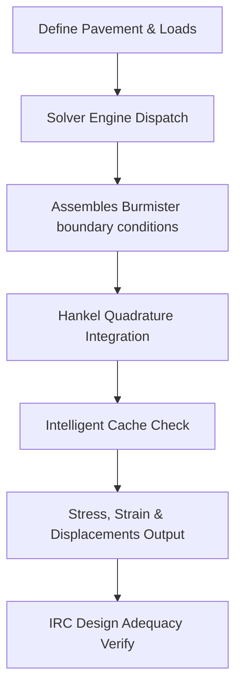

# RoadX Solver Developer Guide

This guide provides technical onboarding, architectural blueprints, and standards for developers working on the RoadX Mechanistic Solver.

## 1. Directory Structure & Code Modules

- `mechanistic_solver/core/`: Layer models, ObservationPoints, config and intelligent caching.
- `mechanistic_solver/math/`: Bessel evaluations and integration utilities.
- `mechanistic_solver/solver/`: Linear system, boundary coefficient matrices assembly, and Hankel integrators.
- `mechanistic_solver/design/`: Structural adequacy validation, fatigue/rutting damage estimation, and layer thickness optimization.
- `mechanistic_solver/validation/`: Parity testing against historical benchmark files.
- `mechanistic_solver/reports/`: Compiled reports for design output, performance, and release validation.

## 2. Execution Pipeline

## 3. Extension & Calibration Policies
- **Core Math Kernels:** Do not alter closed-form integration and boundary systems directly. Modify default settings using SolverProfiles instead.
- **Licensing Restrictions:** Enforce capability blocks via `active_license.check_feature()` checks.
